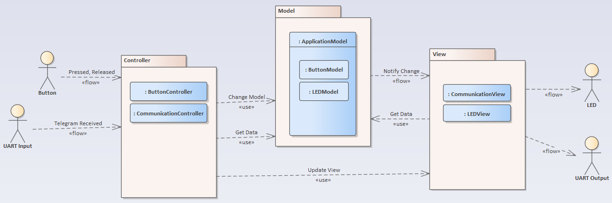
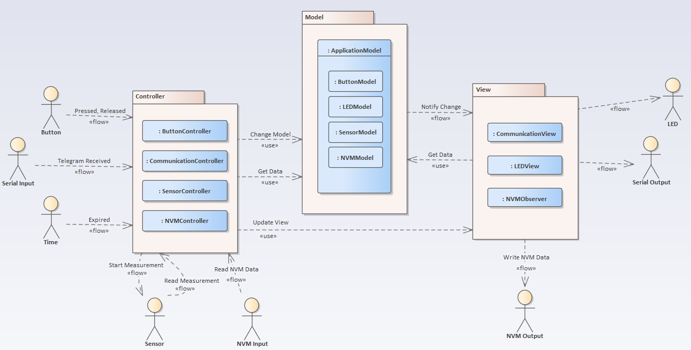
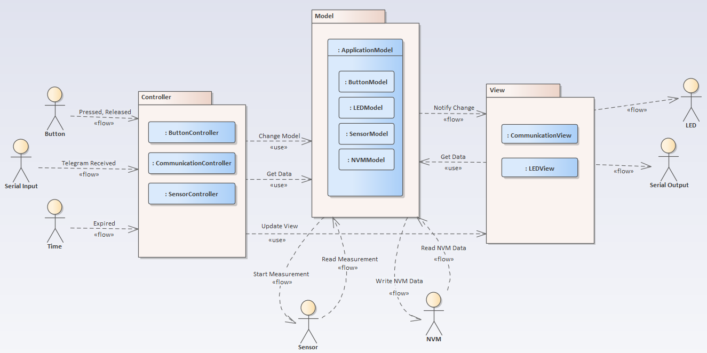
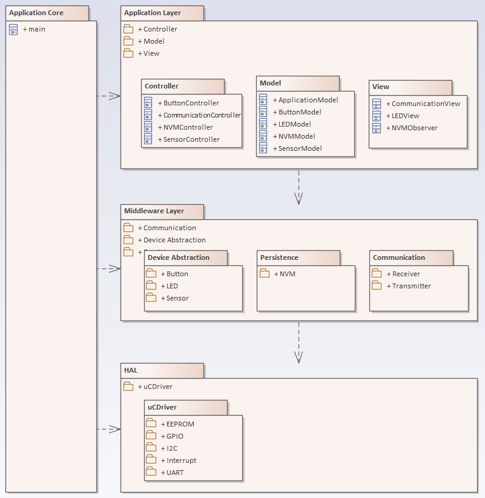

# MVC Pattern в монолитной встроенной системе (в разработке!)
## Основная идея
Как можно реализовать шаблон MVC в монолитной встроенной системе без дисплея? Какие компоненты могут выполнять роли Model, View и Controller?

Идея применения шаблона MVC (Model–View–Controller) во встроенных системах была заимствована из книги "Making Embedded Systems" Алисии Уайт. В открытых источниках доступно ограниченное количество информации о применении MVC во встроенном ПО.
Однако существует релевантная статья "Model View Controller Architecture on Embedded Systems" Абхишека Баджпаи.
Общее определение MVC также можно найти в книге "Pattern-Oriented Software Architecture" Франка Бушмана.
Роль Controller также можно вывести из принципов GRASP (General Responsibility Assignment Software Patterns).

## Обзор шаблона MVC
Шаблон MVC обычно описывается в контексте приложений с пользовательскими интерфейсами, включающими визуальные элементы, т.е. приложений с графическим интерфейсом (GUI).
Этот документ демонстрирует, как концепция MVC может быть реализована во встроенной системе без GUI.

Шаблон MVC определяет разделение ответственности между обработкой ввода, бизнес-логикой и генерацией вывода.
В следующих разделах описаны типовые роли компонентов в общей архитектуре MVC.

### Controller
• Получает ввод от пользователя, внешних источников или системных событий (во встроенных системах: нажатия кнопок, ввод с последовательного интерфейса, таймеры) 
• Интерпретирует ввод и вызывает соответствующие действия в Model 
• Управляет потоком управления и определяет, когда должны выполняться действия Model 

### Model
• Владеет и управляет системными данными и/или реализует основную бизнес-логику 
• Обеспечивает целостность и корректность данных 
• Уведомляет компонент View о изменениях данных 
• Определяет, как данные должны обрабатываться и поддерживаться 

### View
• Отображает данные пользователю или внешнему интерфейсу (во встроенных системах: светодиоды, вывод через последовательный интерфейс, индикаторы) 
• Форматирует данные для представления в соответствии с требованиями системы 

### Уведомление между Model и View с помощью шаблона Observer
Механизм уведомления между Model и Views может быть реализован с использованием шаблона Observer.
Все Views выступают в роли наблюдателей (observers) и должны подписываться на Model для данных, которые их интересуют.
При изменении соответствующих данных Model уведомляет всех подписанных наблюдателей, которые затем могут получить обновленные данные и отобразить их.
См. [Observer Pattern](https://github.com/brackal/Head-First-Design-Patterns-Cpp) и [Callback Pattern](https://github.com/brackal/Embedded-Design-Patterns/tree/main/CallbackPattern)

### Итог
В итоге, шаблон MVC обеспечивает чёткое разделение ответственности в проектировании ПО.
При применении во встроенных системах он помогает изолировать аппаратно-зависимую обработку ввода/вывода (Controller и View) от основной логики (Model), улучшая модульность, поддерживаемость и тестируемость.

## Взаимодействие Controller–Model–View в контексте встроенной системы
Controller получает ввод от пользователя или других систем.
В этом примере ввод генерируется либо нажатием кнопки, либо сообщением (telegram) через последовательный интерфейс. Каждый тип ввода обрабатывается отдельным Controller.

Controllers интерпретируют входные данные и определяют, какие данные нужно изменить в Model.
У них есть как права на чтение, так и на запись модели, и они запускают соответствующие действия по мере необходимости.
В некоторых случаях Controllers также должны получать данные из Model; в таких случаях они могут напрямую обращаться к необходимой информации. 
Controllers также имеют доступ к Views и могут при необходимости инициировать визуализацию или отображение данных.

Model (может состоять из одной сущности или, как в этом примере, из нескольких подмоделей) уведомляет всех подписанных Views при изменении своих данных или состояния.

При получении такого уведомления каждый View — который должен иметь только права на чтение модели — получает соответствующие данные, представляя их в нужном виде. 
В этом примере светодиод (LED) функционирует как визуальный элемент. Передача информации сама по себе может рассматриваться как форма представления данных.

##### Нотация диаграммы и семантика стрелок
На диаграмме стрелки со стереотипом << flow >> представляют поток информации от источника к приёмнику.
Они не указывают на структурную зависимость. Например, Button не зависит от Controller.
Стрелки со стереотипом << use >> указывают на реальную структурную зависимость. 
Например, Controller зависит от Model, что означает, что в реализации Controller должен держать ссылку на Model.

## Расширение MVC для учета сложности встроенных систем
Сначала всё было относительно просто. Теперь ситуация усложняется.
Как должны быть реализованы компоненты, такие как датчики (Sensor) или постоянное хранилище (Persistence)?
Какой компонент MVC отвечает за взаимодействие с этими элементами?

**Specifically:** 
• Является ли задачей Controller запуск измерения датчика и чтение данных, или это ответственность Model? 
• Какой компонент должен управлять постоянными данными: Controller или Model?

Эти вопросы необходимо тщательно рассмотреть, чтобы обеспечить чёткое разделение ответственности, модульность и поддерживаемость архитектуры системы.

### Активные и пассивные модели
Эти вопросы можно решить, поняв, что Model может быть либо активной, либо пассивной.

#### Пассивная модель
Пассивная модель — это чисто модель данных: она хранит данные и может выполнять базовые вычисления.
Пассивная модель не имеет доступа к нижним уровням системы.

**Use Case: Sensor** 
• Sensor Controller определяет, когда нужно сделать измерение. 
• Sensor Controller инициирует измерение на датчике и считывает результаты. 
• Sensor Controller затем обновляет соответствующее значение в Sensor Model (например, температуру). 
• Model уведомляет подписанных наблюдателей, например Communication View, чтобы значение могло быть передано через последовательный интерфейс.

**Use Case: Persistence** 
• NVM Controller определяет, когда данные должны быть прочитаны из постоянного хранилища, и обновляет соответствующую NVM Model. 
• Model уведомляет подписанных NVM Observers (термин «observer» используется для отличия от View). 
• NVM Observer записывает данные в постоянное хранилище.

**In summary:** 
• Controller читает данные с датчиков или из постоянного хранилища. 
• Observer записывает данные в постоянное хранилище или обрабатывает их передачу.

#### Активная модель
Активная модель имеет прямой доступ к компонентам нижнего уровня системы.

**Use Case: Sensor** 
• Sensor Controller определяет, когда нужно сделать измерение (например, каждые 60 секунд). 
• Sensor Controller вызывает соответствующее действие на Sensor Model (например, Model.SensorModel.DoMeasurement()). 
• Sensor Model самостоятельно инициирует измерение на датчике и считывает результаты. 
• После обновления своих данных Model уведомляет подписанных наблюдателей, например Communication View, чтобы значения могли быть переданы через последовательный интерфейс.

**Use Case: Persistence** 
• NVM Model самостоятельно определяет, когда данные должны быть прочитаны или записаны в постоянное хранилище, и выполняет эти операции самостоятельно. 
• В этом случае ни NVM Controller, ни NVM Observers не требуются.

## Вид слоёв

## todo
